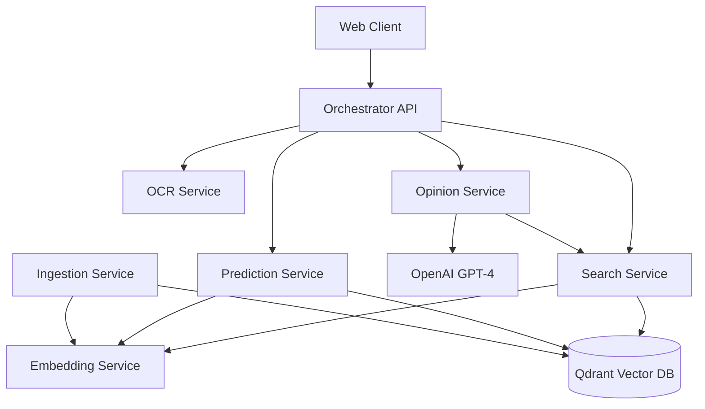

# Code Quality & Security Fixes - Design Document

## Overview
This document provides technical design for fixing critical security vulnerabilities, code errors, and quality improvements identified in the Legal LLM Supreme Court System.

## Architecture Context

### Current System
- Python microservices (FastAPI)
- Qdrant vector database
- Legal-BERT embeddings
- OCR service (Tesseract/Poppler)
- Rust API (currently using mock data)
- Orchestrator API (Python)

### Design Principles
1. Security by default
2. Fail fast on errors
3. Backward compatibility
4. Minimal performance impact
5. Comprehensive testing

---

## 1. Critical Security Fixes (P0)

### 1.1 Complete Incomplete Security Function

**Current Issue**: The `sanitize_query_filter()` function in `python-services/shared/security.py` is incomplete (code cut off mid-function).

**Root Cause**: File was truncated or improperly edited.

**Design Solution**:

Complete the function to properly sanitize NoSQL query filters by:
- Removing MongoDB operators (`$`, `{`, `}`, `[`, `]`)
- Removing SQL injection patterns (`;`, `--`, `/*`, `*/`)
- Removing dangerous stored procedure prefixes (`xp_`, `sp_`)
- Limiting length to 100 characters
- Normalizing whitespace

**Implementation**:
```python
def sanitize_query_filter(filter_value: str) -> str:
    if not filter_value:
        return ""
    
    dangerous_patterns = [
        r'\$',  # MongoDB operators
        r'\{', r'\}', r'\[', r'\]',  # JSON injection
        r';', r'--', r'/\*', r'\*/',  # SQL injection
        r'xp_', r'sp_',  # SQL Server procedures
    ]
    
    sanitized = filter_value
    for pattern in dangerous_patterns:
        sanitized = re.sub(pattern, '', sanitized)
    
    sanitized = sanitized[:100]
    sanitized = re.sub(r'\s+', ' ', sanitized).strip()
    
    return sanitized
```

**Testing**:
- Unit tests with injection patterns
- Verify all dangerous patterns are blocked
- Test edge cases (empty, very long, special chars)

---

### 1.2 Fix Weak JWT Secret Key

**Current Issue**: Default JWT secret is weak and used in production.

**Security Risk**: Token forgery, unauthorized access.

**Design Solution**:


1. Generate strong random default secret at startup
2. Validate production configuration
3. Require `JWT_SECRET_KEY` environment variable in production
4. Add startup validation that fails if default secret is detected

**Implementation**:

In `python-services/shared/config.py`:
```python
import secrets

def generate_secure_secret() -> str:
    """Generate cryptographically secure random secret"""
    return secrets.token_urlsafe(64)

class SecuritySettings(BaseSettings):
    jwt_secret_key: str = Field(
        default_factory=generate_secure_secret,
        env="JWT_SECRET_KEY"
    )
    
    @validator('jwt_secret_key')
    def validate_jwt_secret(cls, v, values):
        if values.get('environment') == 'production':
            # Check if it's the old default
            if v in ['your-secret-key-change-in-production', 
                     'change-this-secret-key-in-production']:
                raise ValueError(
                    "JWT_SECRET_KEY must be set via environment variable in production"
                )
            # Check minimum length
            if len(v) < 32:
                raise ValueError("JWT_SECRET_KEY must be at least 32 characters")
        return v
```

**Documentation**:
Add to `.env.example`:
```bash
# Generate with: python -c "import secrets; print(secrets.token_urlsafe(64))"
JWT_SECRET_KEY=your-generated-secret-here
```

**Testing**:
- Test production validation fails with weak secret
- Test development allows default
- Test secret generation produces unique values

---

### 1.3 Add Authentication to Critical Endpoints

**Current Issue**: Sensitive endpoints lack authentication.

**Affected Endpoints**:
- `/api/analyze-brief` (orchestrator)
- `/ingest/*` (ingestion service)
- `/generate/opinion` (opinion service)

**Design Solution**:


Add JWT authentication dependency to all sensitive endpoints.

**Implementation**:

In `python-services/orchestrator_api.py`:
```python
from shared.security import verify_token
from fastapi import Depends

@app.post("/api/analyze-brief", response_model=AnalyzeResponse)
async def analyze_brief(
    file: UploadFile = File(...),
    user: Dict = Depends(verify_token)  # Add authentication
):
    # Log authenticated request
    logger.info(f"Analyze brief request from user: {user['user_id']}")
    # ... existing code
```

In `python-services/ingestion_service/main.py`:
```python
from shared.security import verify_token, require_role

@app.post("/ingest/case")
async def ingest_case(
    case: CaseLawDocument,
    user: Dict = Depends(require_role("admin"))  # Require admin role
):
    # ... existing code
```

**Exception Handling**:
- Return 401 for missing/invalid tokens
- Return 403 for insufficient permissions
- Include `WWW-Authenticate: Bearer` header

**Testing**:
- Test endpoints reject requests without tokens
- Test endpoints reject invalid tokens
- Test endpoints accept valid tokens
- Test role-based access control

---

### 1.4 Fix CORS Wildcard Configuration

**Current Issue**: Orchestrator uses `allow_origins=["*"]` wildcard.

**Security Risk**: CSRF attacks, unauthorized cross-origin requests.

**Design Solution**:


Use the existing `cors_config.py` module instead of wildcard.

**Implementation**:

In `python-services/orchestrator_api.py`:
```python
from shared.cors_config import setup_cors

app = FastAPI(title="Legal Judge Orchestrator API")

# Replace wildcard CORS with proper configuration
setup_cors(app)
```

The `cors_config.py` already has proper configuration:
- Reads from `ALLOWED_ORIGINS` environment variable
- Defaults to `localhost:3000,localhost:8080` for development
- Requires explicit origins in production

**Environment Configuration**:
```bash
# Development
ALLOWED_ORIGINS=http://localhost:3000,http://localhost:8080

# Production
ALLOWED_ORIGINS=https://yourdomain.com,https://app.yourdomain.com
```

**Testing**:
- Test requests from allowed origins succeed
- Test requests from disallowed origins fail
- Test preflight OPTIONS requests work correctly

---

## 2. Critical Code Errors (P1)

### 2.1 Improve OCR Error Handling

**Current Issue**: Generic exception handling in OCR service.

**Impact**: Difficult to debug failures, poor error messages.

**Design Solution**:


Create specific exception classes and handle each error type.

**Implementation**:

In `ocr-service/main.py`:
```python
class OCRException(Exception):
    """Base exception for OCR errors"""
    pass

class TesseractException(OCRException):
    """Tesseract OCR failed"""
    pass

class PopplerException(OCRException):
    """Poppler PDF conversion failed"""
    pass

class InvalidFileException(OCRException):
    """Invalid file format"""
    pass

@app.post("/ocr/pdf")
async def ocr_pdf(file: UploadFile = File(...)):
    try:
        # Validate file
        if not file.filename.endswith('.pdf'):
            raise InvalidFileException(f"Invalid file type: {file.filename}")
        
        # Convert PDF to images
        try:
            images = convert_from_bytes(pdf_bytes)
        except Exception as e:
            raise PopplerException(f"PDF conversion failed: {str(e)}")
        
        # OCR each page
        try:
            text = pytesseract.image_to_string(image)
        except Exception as e:
            raise TesseractException(f"OCR failed on page {i}: {str(e)}")
            
    except InvalidFileException as e:
        return JSONResponse(
            status_code=400,
            content={"error": "invalid_file", "message": str(e)}
        )
    except PopplerException as e:
        logger.error(f"Poppler error: {e}")
        return JSONResponse(
            status_code=500,
            content={"error": "pdf_conversion_failed", "message": "Failed to convert PDF"}
        )
    except TesseractException as e:
        logger.error(f"Tesseract error: {e}")
        return JSONResponse(
            status_code=500,
            content={"error": "ocr_failed", "message": "Failed to extract text"}
        )
```

**Testing**:
- Test with invalid file types
- Test with corrupted PDFs
- Test with images that fail OCR
- Verify error messages are helpful

---

### 2.2 Implement Rust API Service Integration

**Current Issue**: Rust API returns mock data instead of calling services.

**Impact**: Rust API is non-functional.

**Design Solution**:


Implement HTTP client with proper service calls.

**Implementation**:

In `rust-api/Cargo.toml`:
```toml
[dependencies]
reqwest = { version = "0.11", features = ["json", "multipart"] }
tokio = { version = "1", features = ["full"] }
```

In `rust-api/src/main.rs`:
```rust
use reqwest::Client;
use std::time::Duration;

// Create HTTP client with connection pooling
lazy_static! {
    static ref HTTP_CLIENT: Client = Client::builder()
        .timeout(Duration::from_secs(60))
        .pool_max_idle_per_host(10)
        .build()
        .expect("Failed to create HTTP client");
}

async fn call_ocr_service(file_bytes: Vec<u8>, filename: String) -> Result<String, Error> {
    let ocr_url = env::var("OCR_SERVICE_URL")
        .unwrap_or_else(|_| "http://localhost:8000".to_string());
    
    let form = multipart::Form::new()
        .part("file", multipart::Part::bytes(file_bytes)
            .file_name(filename));
    
    let response = HTTP_CLIENT
        .post(format!("{}/ocr/pdf", ocr_url))
        .multipart(form)
        .send()
        .await?;
    
    if !response.status().is_success() {
        return Err(Error::ServiceError(format!("OCR service failed: {}", response.status())));
    }
    
    let ocr_data: serde_json::Value = response.json().await?;
    Ok(ocr_data["full_text"].as_str().unwrap_or("").to_string())
}

async fn call_search_service(query: String, top_k: i32) -> Result<Vec<SearchResult>, Error> {
    let search_url = env::var("SEARCH_SERVICE_URL")
        .unwrap_or_else(|_| "http://localhost:8003".to_string());
    
    let payload = json!({
        "query": query,
        "top_k": top_k,
        "min_similarity": 0.6
    });
    
    let response = HTTP_CLIENT
        .post(format!("{}/search", search_url))
        .json(&payload)
        .send()
        .await?;
    
    if !response.status().is_success() {
        return Err(Error::ServiceError(format!("Search service failed: {}", response.status())));
    }
    
    let search_data: SearchResponse = response.json().await?;
    Ok(search_data.results)
}
```

**Configuration**:
Add to `.env`:
```bash
OCR_SERVICE_URL=http://localhost:8000
SEARCH_SERVICE_URL=http://localhost:8003
PREDICTION_SERVICE_URL=http://localhost:8004
OPINION_SERVICE_URL=http://localhost:8005
```

**Testing**:
- Integration tests with running services
- Test error handling for service failures
- Test timeout handling
- Test connection pooling

---

### 2.3 Add Input Validation to Orchestrator

**Current Issue**: No file validation before processing.

**Security Risk**: Malicious files, crashes, resource exhaustion.

**Design Solution**:


Use existing `validate_pdf_file()` function from `shared/security.py`.

**Implementation**:

In `python-services/orchestrator_api.py`:
```python
from shared.security import validate_pdf_file

@app.post("/api/analyze-brief", response_model=AnalyzeResponse)
async def analyze_brief(
    file: UploadFile = File(...),
    user: Dict = Depends(verify_token)
):
    try:
        # Read and validate file
        file_content = await file.read()
        validated_content = await validate_pdf_file(file_content, file.filename)
        
        # Continue with processing
        # ... rest of code
        
    except HTTPException:
        raise  # Re-raise validation errors
    except Exception as e:
        logger.error(f"Error in analysis pipeline: {e}")
        raise HTTPException(status_code=500, detail="Internal server error")
```

The `validate_pdf_file()` function already implements:
- File size validation (max 10MB)
- File extension validation (.pdf only)
- PDF magic number validation (`%PDF`)
- Malicious content detection (embedded executables)

**Testing**:
- Test with oversized files (>10MB)
- Test with non-PDF files
- Test with corrupted PDFs
- Test with files containing executables
- Verify proper error responses

---

### 2.4 Fix Year Validation Range

**Current Issue**: Year validation restricted to 2022-2023 only.

**Impact**: Cannot ingest historical or future cases.

**Design Solution**:


Expand year range to 1900-2100 for historical and future cases.

**Implementation**:

In `python-services/shared/models.py`:
```python
class CaseLawDocument(BaseModel):
    case_name: str = Field(..., min_length=5, max_length=500)
    year: int = Field(..., ge=1900, le=2100)  # Changed from ge=2022, le=2023
    # ... rest of fields
```

In `python-services/shared/security.py`:
```python
def validate_year_range(year_range: Optional[tuple]) -> Optional[tuple]:
    if not year_range:
        return None
    
    try:
        start_year, end_year = year_range
        start_year = int(start_year)
        end_year = int(end_year)
        
        # Validate reasonable range (1900-2100)
        if start_year < 1900 or start_year > 2100:
            raise ValueError("Invalid start year")
        if end_year < 1900 or end_year > 2100:
            raise ValueError("Invalid end year")
        if start_year > end_year:
            raise ValueError("Start year must be before end year")
        
        return (start_year, end_year)
    except (ValueError, TypeError) as e:
        logger.warning(f"Invalid year range: {year_range}, error: {e}")
        return None
```

**Backward Compatibility**:
- Existing data with years 2022-2023 remains valid
- No migration needed
- Validation is more permissive, not restrictive

**Testing**:
- Test with historical years (1900-2021)
- Test with current years (2022-2024)
- Test with future years (2025-2100)
- Test boundary values (1900, 2100)
- Test invalid years (<1900, >2100)

---

### 2.5 Fix Vector Dimension Validation

**Current Issue**: Dimension mismatch only logs warning, doesn't fail.

**Impact**: Corrupted vector index, search failures.

**Design Solution**:


Raise exception for dimension mismatches to fail fast.

**Implementation**:

In `python-services/embedding_service/service.py`:
```python
def __init__(self, model_name: str = "nlpaueb/legal-bert-base-uncased", ...):
    # ... existing initialization
    
    # Verify embedding dimension
    test_embedding = self.model.encode("test", convert_to_numpy=True)
    self.embedding_dim = len(test_embedding)
    
    # Fail fast if dimension is wrong
    if self.embedding_dim != 768:
        raise ValueError(
            f"Model produces {self.embedding_dim}-dimensional embeddings, "
            f"but system requires 768 dimensions. "
            f"Please use a compatible model or update EMBEDDING_DIMENSION config."
        )
    
    logger.success(f"Verified embedding dimension: {self.embedding_dim}")
```

In `python-services/shared/models.py`:
```python
class VectorDocument(BaseModel):
    vector: List[float]
    
    @validator('vector')
    def validate_vector_dimension(cls, v):
        expected_dim = 768
        if len(v) != expected_dim:
            raise ValueError(
                f"Vector dimension mismatch: expected {expected_dim}, got {len(v)}. "
                f"This indicates a model configuration error."
            )
        return v
```

**Error Messages**:
- Clear indication of expected vs actual dimensions
- Guidance on how to fix (use correct model or update config)
- Prevent silent data corruption

**Testing**:
- Test with correct 768-dimensional vectors
- Test with wrong dimensions (384, 1024, etc.)
- Verify exception is raised, not just logged
- Test error message clarity

---

## 3. Performance Improvements (P2)

### 3.1 Implement HTTP Connection Pooling

**Current Issue**: New HTTP connection for each request.

**Impact**: High latency, resource waste.

**Design Solution**:


Create singleton `httpx.AsyncClient` instances with connection pooling.

**Implementation**:

Create `python-services/shared/http_client.py`:
```python
import httpx
from typing import Optional
from loguru import logger

class HTTPClientManager:
    """Singleton HTTP client manager with connection pooling"""
    
    _instance: Optional[httpx.AsyncClient] = None
    
    @classmethod
    def get_client(cls) -> httpx.AsyncClient:
        """Get or create the singleton HTTP client"""
        if cls._instance is None:
            cls._instance = httpx.AsyncClient(
                timeout=httpx.Timeout(30.0, connect=5.0),
                limits=httpx.Limits(
                    max_connections=100,
                    max_keepalive_connections=20
                ),
                http2=True
            )
            logger.info("Created HTTP client with connection pooling")
        return cls._instance
    
    @classmethod
    async def close(cls):
        """Close the HTTP client"""
        if cls._instance is not None:
            await cls._instance.aclose()
            cls._instance = None
            logger.info("Closed HTTP client")

# Convenience function
def get_http_client() -> httpx.AsyncClient:
    return HTTPClientManager.get_client()
```

Usage in services:
```python
from shared.http_client import get_http_client

@app.on_event("startup")
async def startup():
    # Client is created on first use
    pass

@app.on_event("shutdown")
async def shutdown():
    from shared.http_client import HTTPClientManager
    await HTTPClientManager.close()

async def call_service():
    client = get_http_client()
    response = await client.post(url, json=data)
    return response.json()
```

**Configuration**:
- Connection timeout: 5 seconds
- Request timeout: 30 seconds
- Max connections: 100
- Max keepalive: 20
- HTTP/2 enabled

**Testing**:
- Performance test showing latency improvement
- Test connection reuse
- Test connection limits
- Test timeout handling

---

### 3.2 Add Async File I/O

**Current Issue**: Synchronous file operations block event loop.

**Impact**: Reduced throughput, poor concurrency.

**Design Solution**:


Use `aiofiles` for async file operations.

**Implementation**:

Add to `python-services/requirements.txt`:
```
aiofiles==23.2.1
```

In `python-services/shared/audit_logger.py`:
```python
import aiofiles
import asyncio
from datetime import datetime

class AuditLogger:
    async def log_event(self, event_type: str, user_id: str, details: dict):
        """Log audit event asynchronously"""
        log_entry = {
            "timestamp": datetime.utcnow().isoformat(),
            "event_type": event_type,
            "user_id": user_id,
            "details": details
        }
        
        log_file = f"{self.log_dir}/audit_{datetime.utcnow().date()}.jsonl"
        
        # Async file write
        async with aiofiles.open(log_file, mode='a') as f:
            await f.write(json.dumps(log_entry) + '\n')
```

**Migration**:
Replace all `open()` calls in async contexts:
```python
# Before
with open(file_path, 'r') as f:
    data = f.read()

# After
async with aiofiles.open(file_path, 'r') as f:
    data = await f.read()
```

**Testing**:
- Performance test showing improved throughput
- Test concurrent file operations
- Verify no event loop blocking

---

### 3.3 Optimize Qdrant Index Configuration

**Current Issue**: Default HNSW parameters not optimized.

**Impact**: Slower searches, higher memory usage.

**Design Solution**:


Configure HNSW index parameters for optimal performance.

**Implementation**:

In `python-services/vector_index/service.py`:
```python
from qdrant_client.models import VectorParams, Distance, HnswConfigDiff

async def create_collection(self, collection_name: str, vector_size: int = 768):
    """Create Qdrant collection with optimized HNSW parameters"""
    
    self.client.create_collection(
        collection_name=collection_name,
        vectors_config=VectorParams(
            size=vector_size,
            distance=Distance.COSINE
        ),
        hnsw_config=HnswConfigDiff(
            m=16,              # Number of edges per node (default: 16)
            ef_construct=100,  # Construction time/quality tradeoff (default: 100)
            full_scan_threshold=10000,  # Use full scan for small collections
            on_disk=False      # Keep index in memory for speed
        ),
        optimizers_config={
            "indexing_threshold": 20000,  # Start indexing after 20k vectors
            "memmap_threshold": 50000     # Use memory mapping after 50k vectors
        }
    )
    
    logger.info(f"Created collection '{collection_name}' with optimized HNSW config")
```

**Parameters Explained**:
- `m=16`: Good balance between speed and accuracy
- `ef_construct=100`: Higher quality index construction
- `full_scan_threshold=10000`: Use brute force for small datasets
- `on_disk=False`: Keep in memory for faster searches

**Testing**:
- Benchmark search latency before/after
- Test with various collection sizes
- Measure memory usage
- Verify accuracy maintained

---

## 4. Configuration Improvements (P2)

### 4.1 Add Environment Variable Validation

**Current Issue**: Missing env vars cause runtime failures.

**Impact**: Poor developer experience, production incidents.

**Design Solution**:


Validate all required environment variables at startup.

**Implementation**:

In `python-services/shared/config.py`:
```python
def validate_environment_variables():
    """Validate all required environment variables"""
    errors = []
    warnings = []
    
    # Required in all environments
    required_vars = {
        'QDRANT_HOST': str,
        'QDRANT_PORT': int,
    }
    
    # Required in production
    if os.getenv('ENVIRONMENT') == 'production':
        required_vars.update({
            'JWT_SECRET_KEY': str,
            'ALLOWED_ORIGINS': str,
            'OPENAI_API_KEY': str,
        })
    
    # Validate presence and type
    for var_name, var_type in required_vars.items():
        value = os.getenv(var_name)
        
        if value is None:
            errors.append(f"Missing required environment variable: {var_name}")
            continue
        
        # Type validation
        try:
            if var_type == int:
                int(value)
            elif var_type == float:
                float(value)
            elif var_type == bool:
                if value.lower() not in ['true', 'false', '1', '0']:
                    raise ValueError()
        except ValueError:
            errors.append(f"Invalid type for {var_name}: expected {var_type.__name__}")
    
    # URL format validation
    url_vars = ['QDRANT_HOST', 'REDIS_HOST', 'OCR_SERVICE_URL']
    for var_name in url_vars:
        value = os.getenv(var_name)
        if value and not (value.startswith('http://') or 
                         value.startswith('https://') or 
                         '.' in value or 
                         value == 'localhost'):
            warnings.append(f"{var_name} may have invalid format: {value}")
    
    # Report errors
    if errors:
        error_msg = "Environment validation failed:\n" + "\n".join(f"  - {e}" for e in errors)
        raise ValueError(error_msg)
    
    if warnings:
        logger.warning("Environment validation warnings:")
        for w in warnings:
            logger.warning(f"  - {w}")
    
    logger.success("Environment validation passed")

# Call at startup
@app.on_event("startup")
async def startup():
    validate_environment_variables()
    log_configuration()
```

**Testing**:
- Test with missing required vars
- Test with invalid types
- Test with invalid URLs
- Verify clear error messages

---

### 4.2 Remove Hardcoded URLs

**Current Issue**: Service URLs hardcoded to localhost.

**Impact**: Cannot deploy to different environments.

**Design Solution**:


Replace all hardcoded URLs with environment variables.

**Implementation**:

In `python-services/shared/config.py`:
```python
class ServiceSettings(BaseSettings):
    # Service URLs (not just ports)
    ocr_service_url: str = Field(
        default="http://localhost:8000",
        env="OCR_SERVICE_URL"
    )
    embedding_service_url: str = Field(
        default="http://localhost:8001",
        env="EMBEDDING_SERVICE_URL"
    )
    ingestion_service_url: str = Field(
        default="http://localhost:8002",
        env="INGESTION_SERVICE_URL"
    )
    search_service_url: str = Field(
        default="http://localhost:8003",
        env="SEARCH_SERVICE_URL"
    )
    prediction_service_url: str = Field(
        default="http://localhost:8004",
        env="PREDICTION_SERVICE_URL"
    )
    opinion_service_url: str = Field(
        default="http://localhost:8005",
        env="OPINION_SERVICE_URL"
    )
```

In `python-services/orchestrator_api.py`:
```python
from shared.config import get_service_settings

settings = get_service_settings()

async def analyze_brief(...):
    # Use configured URLs
    ocr_response = await client.post(
        f"{settings.ocr_service_url}/ocr/pdf",
        files=files
    )
    
    search_response = await client.post(
        f"{settings.search_service_url}/search",
        json=payload
    )
```

**Docker Compose Configuration**:
```yaml
services:
  orchestrator:
    environment:
      - OCR_SERVICE_URL=http://ocr-service:8000
      - SEARCH_SERVICE_URL=http://search-service:8003
      - PREDICTION_SERVICE_URL=http://prediction-service:8004
      - OPINION_SERVICE_URL=http://opinion-service:8005
```

**Testing**:
- Test with different URL configurations
- Test Docker deployment with service names
- Test localhost development setup

---

## 5. Testing Improvements (P2)

### 5.1 Fix Test Skipping Behavior

**Current Issue**: Tests skip when services unavailable.

**Impact**: CI/CD doesn't catch integration issues.

**Design Solution**:


Separate unit tests (with mocks) from integration tests (require services).

**Implementation**:

Reorganize tests:
```
python-services/tests/
├── unit/
│   ├── test_security.py
│   ├── test_validators.py
│   ├── test_models.py
│   └── test_parsers.py
└── integration/
    ├── test_embedding_service.py
    ├── test_search_service.py
    └── test_api_integration.py
```

In `python-services/tests/unit/test_security.py`:
```python
import pytest
from shared.security import sanitize_query_filter, validate_pdf_file

# Unit tests use mocks, no external dependencies
def test_sanitize_query_filter_removes_mongodb_operators():
    malicious = "user$where: function() { return true; }"
    sanitized = sanitize_query_filter(malicious)
    assert "$" not in sanitized
    assert "{" not in sanitized

def test_validate_pdf_file_rejects_oversized():
    large_file = b"%PDF" + b"x" * (11 * 1024 * 1024)  # 11MB
    with pytest.raises(HTTPException) as exc:
        await validate_pdf_file(large_file, "test.pdf")
    assert exc.value.status_code == 413
```

In `python-services/tests/integration/test_embedding_service.py`:
```python
import pytest
import httpx

# Integration tests require services running
@pytest.mark.integration
async def test_embedding_service_generates_vectors():
    async with httpx.AsyncClient() as client:
        response = await client.post(
            "http://localhost:8001/embed",
            json={"text": "Test legal document"}
        )
        assert response.status_code == 200
        data = response.json()
        assert len(data["embedding"]) == 768
```

**CI/CD Configuration**:
```yaml
# .github/workflows/test.yml
- name: Run unit tests
  run: pytest tests/unit/ -v

- name: Start services
  run: docker-compose up -d

- name: Run integration tests
  run: pytest tests/integration/ -v --maxfail=1
```

**Testing**:
- Unit tests run without any services
- Integration tests fail if services unavailable
- Clear separation of test types

---

### 5.2 Add Unit Tests

**Current Issue**: Mostly integration tests, few unit tests.

**Impact**: Slow test suite, hard to debug failures.

**Design Solution**:


Add comprehensive unit tests for core functions.

**Implementation**:

Create `python-services/tests/unit/test_security.py`:
```python
import pytest
from shared.security import (
    sanitize_query_filter,
    sanitize_llm_input,
    redact_pii,
    validate_pdf_file
)

class TestSanitizeQueryFilter:
    def test_removes_mongodb_operators(self):
        assert "$" not in sanitize_query_filter("test$where")
        assert "{" not in sanitize_query_filter("test{}")
    
    def test_removes_sql_injection(self):
        assert ";" not in sanitize_query_filter("test; DROP TABLE")
        assert "--" not in sanitize_query_filter("test--comment")
    
    def test_limits_length(self):
        long_input = "a" * 200
        result = sanitize_query_filter(long_input)
        assert len(result) <= 100
    
    def test_handles_empty_input(self):
        assert sanitize_query_filter("") == ""
        assert sanitize_query_filter(None) == ""

class TestRedactPII:
    def test_redacts_email(self):
        text = "Contact user@example.com for info"
        result = redact_pii(text)
        assert "user@example.com" not in result
        assert "[EMAIL_REDACTED]" in result
    
    def test_redacts_phone(self):
        text = "Call 555-123-4567"
        result = redact_pii(text)
        assert "555-123-4567" not in result
        assert "[PHONE_REDACTED]" in result
    
    def test_redacts_ssn(self):
        text = "SSN: 123-45-6789"
        result = redact_pii(text)
        assert "123-45-6789" not in result
        assert "[SSN_REDACTED]" in result

class TestValidatePDFFile:
    @pytest.mark.asyncio
    async def test_accepts_valid_pdf(self):
        valid_pdf = b"%PDF-1.4\n%content"
        result = await validate_pdf_file(valid_pdf, "test.pdf")
        assert result == valid_pdf
    
    @pytest.mark.asyncio
    async def test_rejects_oversized_file(self):
        large_file = b"%PDF" + b"x" * (11 * 1024 * 1024)
        with pytest.raises(HTTPException) as exc:
            await validate_pdf_file(large_file, "test.pdf")
        assert exc.value.status_code == 413
    
    @pytest.mark.asyncio
    async def test_rejects_non_pdf(self):
        with pytest.raises(HTTPException) as exc:
            await validate_pdf_file(b"not a pdf", "test.txt")
        assert exc.value.status_code == 400
```

Create `python-services/tests/unit/test_validators.py`:
```python
from shared.validators import validate_year_range
from shared.models import CaseLawDocument

class TestYearValidation:
    def test_accepts_historical_years(self):
        result = validate_year_range((1950, 2000))
        assert result == (1950, 2000)
    
    def test_accepts_future_years(self):
        result = validate_year_range((2024, 2030))
        assert result == (2024, 2030)
    
    def test_rejects_invalid_range(self):
        result = validate_year_range((2030, 2020))
        assert result is None
    
    def test_rejects_out_of_bounds(self):
        result = validate_year_range((1800, 2000))
        assert result is None
```

**Coverage Target**: 80%+ for core logic

**Testing**:
- Run with `pytest tests/unit/ --cov=shared --cov-report=html`
- Verify coverage meets target
- Tests run in <5 seconds

---

## 6. Architecture Improvements (P3)

### 6.1 Add Service Health Checks

**Current Issue**: Basic health checks don't verify dependencies.

**Impact**: Services report healthy when dependencies are down.

**Design Solution**:


Implement comprehensive health checks with dependency status.

**Implementation**:

Create `python-services/shared/health.py`:
```python
from fastapi import APIRouter
from typing import Dict, Any
import time
from loguru import logger

router = APIRouter()

class HealthChecker:
    def __init__(self):
        self.start_time = time.time()
        self.checks = []
    
    def add_check(self, name: str, check_func):
        """Register a health check function"""
        self.checks.append((name, check_func))
    
    async def run_checks(self) -> Dict[str, Any]:
        """Run all health checks"""
        results = {
            "status": "healthy",
            "uptime_seconds": int(time.time() - self.start_time),
            "checks": {}
        }
        
        for name, check_func in self.checks:
            try:
                check_result = await check_func()
                results["checks"][name] = {
                    "status": "healthy" if check_result else "unhealthy",
                    "details": check_result
                }
                if not check_result:
                    results["status"] = "degraded"
            except Exception as e:
                logger.error(f"Health check '{name}' failed: {e}")
                results["checks"][name] = {
                    "status": "unhealthy",
                    "error": str(e)
                }
                results["status"] = "unhealthy"
        
        return results

health_checker = HealthChecker()

@router.get("/health")
async def health_check():
    return await health_checker.run_checks()

@router.get("/health/live")
async def liveness():
    """Kubernetes liveness probe"""
    return {"status": "alive"}

@router.get("/health/ready")
async def readiness():
    """Kubernetes readiness probe"""
    results = await health_checker.run_checks()
    if results["status"] == "unhealthy":
        return JSONResponse(
            status_code=503,
            content=results
        )
    return results
```

Usage in services:
```python
from shared.health import health_checker, router as health_router
from qdrant_client import QdrantClient

app.include_router(health_router)

# Register checks
async def check_qdrant():
    try:
        client = QdrantClient(host=settings.qdrant_host, port=settings.qdrant_port)
        collections = client.get_collections()
        return {"connected": True, "collections": len(collections.collections)}
    except Exception as e:
        return False

async def check_model_loaded():
    try:
        service = get_embedding_service()
        return {"model": service.model_name, "dimension": service.embedding_dim}
    except Exception:
        return False

health_checker.add_check("qdrant", check_qdrant)
health_checker.add_check("model", check_model_loaded)
```

**Response Format**:
```json
{
  "status": "healthy",
  "uptime_seconds": 3600,
  "checks": {
    "qdrant": {
      "status": "healthy",
      "details": {"connected": true, "collections": 1}
    },
    "model": {
      "status": "healthy",
      "details": {"model": "nlpaueb/legal-bert-base-uncased", "dimension": 768}
    }
  }
}
```

**Testing**:
- Test with all dependencies healthy
- Test with Qdrant down
- Test with model not loaded
- Verify response times <100ms

---

### 6.2 Implement Structured Logging

**Current Issue**: Unstructured text logs, hard to parse.

**Impact**: Poor observability, difficult debugging.

**Design Solution**:


Configure structured JSON logging with correlation IDs.

**Implementation**:

Create `python-services/shared/logging_config.py`:
```python
import sys
import json
from loguru import logger
from contextvars import ContextVar
import uuid

# Context variable for request ID
request_id_var: ContextVar[str] = ContextVar('request_id', default='')

def get_request_id() -> str:
    return request_id_var.get() or str(uuid.uuid4())

def set_request_id(request_id: str):
    request_id_var.set(request_id)

def json_formatter(record):
    """Format log records as JSON"""
    log_entry = {
        "timestamp": record["time"].isoformat(),
        "level": record["level"].name,
        "message": record["message"],
        "request_id": get_request_id(),
        "service": record["extra"].get("service", "unknown"),
        "function": record["function"],
        "line": record["line"],
    }
    
    # Add exception info if present
    if record["exception"]:
        log_entry["exception"] = {
            "type": record["exception"].type.__name__,
            "value": str(record["exception"].value),
            "traceback": record["exception"].traceback
        }
    
    # Add extra fields
    for key, value in record["extra"].items():
        if key not in ["service"]:
            log_entry[key] = value
    
    return json.dumps(log_entry)

def setup_logging(service_name: str, log_level: str = "INFO"):
    """Configure structured logging for a service"""
    
    # Remove default handler
    logger.remove()
    
    # Add JSON handler for production
    if os.getenv("ENVIRONMENT") == "production":
        logger.add(
            sys.stdout,
            format=json_formatter,
            level=log_level,
            serialize=False
        )
    else:
        # Human-readable for development
        logger.add(
            sys.stdout,
            format="<green>{time:YYYY-MM-DD HH:mm:ss}</green> | <level>{level: <8}</level> | <cyan>{extra[request_id]}</cyan> | <level>{message}</level>",
            level=log_level,
            colorize=True
        )
    
    # Bind service name
    logger.configure(extra={"service": service_name, "request_id": ""})
    
    return logger
```

Middleware for request IDs:
```python
from starlette.middleware.base import BaseHTTPMiddleware
from shared.logging_config import set_request_id, get_request_id

class RequestIDMiddleware(BaseHTTPMiddleware):
    async def dispatch(self, request, call_next):
        # Get or generate request ID
        request_id = request.headers.get("X-Request-ID", str(uuid.uuid4()))
        set_request_id(request_id)
        
        # Add to response headers
        response = await call_next(request)
        response.headers["X-Request-ID"] = request_id
        
        return response

# Add to app
app.add_middleware(RequestIDMiddleware)
```

Usage:
```python
from shared.logging_config import setup_logging

logger = setup_logging("search-service", "INFO")

logger.info("Processing search request", query=query, top_k=top_k)
logger.error("Search failed", error=str(e), user_id=user_id)
```

**Testing**:
- Verify JSON format in production
- Verify request IDs propagate
- Test PII redaction still works

---

### 6.3 Add Metrics Endpoints

**Current Issue**: No metrics for monitoring.

**Impact**: Cannot track performance, errors, usage.

**Design Solution**:


Add Prometheus metrics endpoints.

**Implementation**:

Add to `python-services/requirements.txt`:
```
prometheus-client==0.19.0
prometheus-fastapi-instrumentator==6.1.0
```

Create `python-services/shared/metrics.py`:
```python
from prometheus_client import Counter, Histogram, Gauge
from prometheus_fastapi_instrumentator import Instrumentator

# Request metrics
request_count = Counter(
    'http_requests_total',
    'Total HTTP requests',
    ['method', 'endpoint', 'status']
)

request_duration = Histogram(
    'http_request_duration_seconds',
    'HTTP request duration',
    ['method', 'endpoint']
)

# Business metrics
searches_total = Counter(
    'searches_total',
    'Total search requests',
    ['status']
)

predictions_total = Counter(
    'predictions_total',
    'Total prediction requests',
    ['outcome']
)

embeddings_generated = Counter(
    'embeddings_generated_total',
    'Total embeddings generated'
)

vector_index_size = Gauge(
    'vector_index_size',
    'Number of vectors in index'
)

# Error metrics
errors_total = Counter(
    'errors_total',
    'Total errors',
    ['service', 'error_type']
)

def setup_metrics(app, service_name: str):
    """Setup Prometheus metrics for FastAPI app"""
    
    instrumentator = Instrumentator(
        should_group_status_codes=False,
        should_ignore_untemplated=True,
        should_respect_env_var=True,
        should_instrument_requests_inprogress=True,
        excluded_handlers=["/metrics", "/health"],
        env_var_name="ENABLE_METRICS",
        inprogress_name="http_requests_inprogress",
        inprogress_labels=True,
    )
    
    instrumentator.instrument(app).expose(app, endpoint="/metrics")
    
    return instrumentator
```

Usage in services:
```python
from shared.metrics import setup_metrics, searches_total, errors_total

app = FastAPI()
setup_metrics(app, "search-service")

@app.post("/search")
async def search(request: SearchRequest):
    try:
        results = await perform_search(request)
        searches_total.labels(status="success").inc()
        return results
    except Exception as e:
        searches_total.labels(status="error").inc()
        errors_total.labels(service="search", error_type=type(e).__name__).inc()
        raise
```

**Metrics Exposed**:
- `http_requests_total` - Request count by method, endpoint, status
- `http_request_duration_seconds` - Request latency histogram
- `searches_total` - Search requests by status
- `predictions_total` - Predictions by outcome
- `embeddings_generated_total` - Total embeddings created
- `vector_index_size` - Current index size
- `errors_total` - Errors by service and type

**Testing**:
- Verify `/metrics` endpoint returns Prometheus format
- Test metric increments
- Test histogram buckets

---

## 7. Documentation Improvements (P3)

### 7.1 Add OpenAPI Documentation

**Current Issue**: No comprehensive API documentation.

**Impact**: Poor developer experience.

**Design Solution**:


Enhance FastAPI OpenAPI documentation with examples and descriptions.

**Implementation**:

```python
from fastapi import FastAPI
from fastapi.openapi.utils import get_openapi

app = FastAPI(
    title="Legal LLM Supreme Court System",
    description="AI-powered legal analysis and opinion generation system",
    version="1.0.0",
    docs_url="/docs",
    redoc_url="/redoc",
    openapi_url="/openapi.json"
)

# Add examples to models
class SearchRequest(BaseModel):
    query: str = Field(
        ...,
        description="Legal text to search for similar cases",
        example="Whether landlord breached implied warranty of habitability"
    )
    top_k: int = Field(
        default=10,
        description="Number of results to return",
        example=10,
        ge=1,
        le=100
    )

# Add response examples to endpoints
@app.post(
    "/search",
    response_model=SearchResponse,
    summary="Search for similar legal cases",
    description="Performs semantic search over Supreme Court cases using Legal-BERT embeddings",
    responses={
        200: {
            "description": "Successful search",
            "content": {
                "application/json": {
                    "example": {
                        "results": [
                            {
                                "case_name": "Hilder v. St. Peter",
                                "similarity_score": 0.92,
                                "snippet": "Implied warranty of habitability..."
                            }
                        ]
                    }
                }
            }
        },
        401: {"description": "Unauthorized"},
        500: {"description": "Internal server error"}
    }
)
async def search(request: SearchRequest, user: Dict = Depends(verify_token)):
    pass
```

**Testing**:
- Verify `/docs` renders correctly
- Test all examples are valid
- Verify authentication documented

---

### 7.2 Create Architecture Diagrams

**Current Issue**: No visual documentation of system architecture.

**Design Solution**:

Create diagrams using Mermaid in documentation.

**System Architecture**:


Add to `ARCHITECTURE.md` with detailed explanations.

---

## Implementation Strategy

### Phase 1: P0 Security Fixes (Week 1)
1. Complete `sanitize_query_filter()` function
2. Fix JWT secret validation
3. Add authentication to endpoints
4. Fix CORS configuration

### Phase 2: P1 Critical Errors (Week 2)
1. Improve OCR error handling
2. Implement Rust API service calls
3. Add input validation
4. Fix year validation
5. Fix vector dimension validation

### Phase 3: P2 Performance & Quality (Week 3)
1. HTTP connection pooling
2. Async file I/O
3. Qdrant optimization
4. Environment validation
5. Remove hardcoded URLs
6. Test improvements

### Phase 4: P3 Architecture & Docs (Week 4)
1. Health checks
2. Structured logging
3. Metrics endpoints
4. OpenAPI documentation
5. Architecture diagrams

---

## Testing Strategy

### Unit Tests
- All security functions
- All validators
- All parsers
- Target: 80%+ coverage

### Integration Tests
- Service-to-service communication
- Database operations
- End-to-end workflows

### Security Tests
- Injection attack prevention
- Authentication/authorization
- File upload validation

### Performance Tests
- Connection pooling impact
- Async I/O improvements
- Search latency

---

## Rollback Plan

Each fix is independent and can be rolled back individually:
1. Keep feature flags for major changes
2. Database changes are backward compatible
3. API changes are versioned
4. Configuration changes have defaults

---

## Success Metrics

### Security
- Zero critical vulnerabilities in security scan
- All endpoints authenticated
- No injection vulnerabilities

### Performance
- 20% reduction in average response time
- 50% reduction in connection overhead
- <100ms health check response

### Quality
- 80%+ test coverage
- Zero P0/P1 bugs in production
- <5 minute deployment time

### Observability
- All services have health checks
- All services expose metrics
- Structured logs in production
