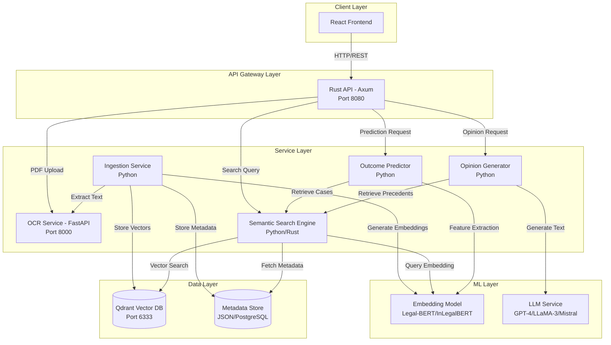

# Design Document: Legal LLM Supreme Court System

## Overview

The Legal LLM Supreme Court System is an AI-powered platform that vectorizes, indexes, and analyzes Supreme Court case laws from 2022-2023. The system provides semantic legal search capabilities, predicts judicial outcomes, and generates judicial opinions in official Supreme Court format using Retrieval-Augmented Generation (RAG).

The system builds upon existing infrastructure:
- **Rust API (Axum)**: Core orchestration and business logic
- **Python OCR Service (FastAPI)**: PDF text extraction using Tesseract
- **React Frontend**: User interface for uploading briefs and viewing results
- **Qdrant Vector Database**: Vector storage and similarity search
- **Sentence Transformers**: Legal-BERT/InLegalBERT embeddings

The design follows a microservices architecture with clear separation between ingestion, search, prediction, and generation components.

## Architecture

### System Architecture Diagram



### Component Responsibilities

**Rust API (Axum)**
- API gateway and request routing
- Authentication and rate limiting
- Request validation and error handling
- Orchestration of downstream services

**OCR Service (FastAPI)**
- PDF to text extraction using Tesseract
- Image preprocessing for OCR quality
- Page-by-page text extraction
- Fallback handling for OCR failures

**Ingestion Service (Python)**
- Case law document parsing and structuring
- Section extraction (facts, issues, reasoning, holding, judgment)
- Data validation and quality checks
- Batch processing of case law corpus
- Coordination with embedding and storage services

**Semantic Search Engine (Python/Rust)**
- Query embedding generation
- Vector similarity search via Qdrant
- Result ranking and filtering
- Metadata enrichment of search results

**Outcome Predictor (Python)**
- Feature extraction from case facts and issues
- Historical pattern analysis
- Outcome classification (Affirmed, Reversed, Remanded)
- Probability score calculation

**Opinion Generator (Python)**
- RAG pipeline implementation
- Precedent retrieval and context assembly
- LLM prompt engineering for judicial tone
- Opinion structure formatting
- Citation generation

**Embedding Model (Legal-BERT/InLegalBERT)**
- Domain-specific legal text encoding
- Consistent vector dimensionality
- Batch processing support
- Fine-tuned on legal corpus

**Vector Database (Qdrant)**
- High-dimensional vector storage
- Fast similarity search (cosine/dot product)
- Metadata filtering
- Scalable indexing for 1,000+ documents

## Components and Interfaces

### 1. Ingestion Service

**Purpose**: Process and structure Supreme Court case law documents for indexing.

**Interface**:
```python
class IngestionService:
    def ingest_pdf(self, pdf_path: str) -> CaseLawDocument:
        """Extract and structure case law from PDF"""
        
    def parse_case_law(self, text: str) -> CaseLawDocument:
        """Parse extracted text into structured format"""
        
    def validate_document(self, doc: CaseLawDocument) -> ValidationResult:
        """Validate document against schema and quality rules"""
        
    def batch_ingest(self, pdf_directory: str, batch_size: int = 10) -> List[IngestionResult]:
        """Process multiple PDFs in batches"""
```

**Processing Pipeline**:
1. PDF Upload → OCR Service
2. Text Extraction → Section Parser
3. Structure Validation → Schema Validator
4. Embedding Generation → Embedding Model
5. Vector Storage → Qdrant
6. Metadata Storage → Metadata Store

**Section Parsing Strategy**:
- Use regex patterns and NLP to identify section boundaries
- Common markers: "FACTS:", "ISSUE:", "REASONING:", "HOLDING:", "JUDGMENT:"
- Fallback to heuristic-based parsing for non-standard formats
- Manual review queue for low-confidence parses

### 2. Embedding Model Service

**Purpose**: Convert legal text to high-dimensional vector embeddings.

**Interface**:
```python
class EmbeddingService:
    def __init__(self, model_name: str = "nlpaueb/legal-bert-base-uncased"):
        """Initialize Legal-BERT or InLegalBERT model"""
        
    def encode_text(self, text: str) -> np.ndarray:
        """Generate embedding for single text"""
        
    def encode_batch(self, texts: List[str]) -> np.ndarray:
        """Generate embeddings for batch of texts"""
        
    def get_embedding_dimension(self) -> int:
        """Return vector dimensionality (typically 768)"""
```

**Model Selection**:
- **Primary**: `nlpaueb/legal-bert-base-uncased` (768 dimensions)
- **Alternative**: `law-ai/InLegalBERT` (768 dimensions)
- Both models are pre-trained on legal corpora
- Use sentence-transformers library for efficient encoding

**Optimization**:
- Batch processing with configurable batch size (default: 32)
- GPU acceleration when available
- Caching for frequently encoded queries
- Max sequence length: 512 tokens (BERT limit)

### 3. Vector Index Service

**Purpose**: Store and retrieve case law embeddings using Qdrant.

**Interface**:
```python
class VectorIndexService:
    def __init__(self, qdrant_url: str = "http://localhost:6333"):
        """Initialize Qdrant client"""
        
    def create_collection(self, collection_name: str, vector_size: int):
        """Create vector collection with specified dimensions"""
        
    def index_document(self, doc_id: str, vectors: Dict[str, np.ndarray], metadata: dict):
        """Index document with multiple section vectors"""
        
    def search_similar(self, query_vector: np.ndarray, top_k: int = 10, 
                      filters: dict = None) -> List[SearchResult]:
        """Perform similarity search with optional metadata filters"""
        
    def delete_document(self, doc_id: str):
        """Remove document from index"""
```

**Collection Schema**:
```python
{
    "collection_name": "supreme_court_cases",
    "vector_size": 768,
    "distance": "Cosine",
    "payload_schema": {
        "case_name": "keyword",
        "year": "integer",
        "court": "keyword",
        "opinion_type": "keyword",
        "section_type": "keyword"  # facts, issue, reasoning, holding, judgment
    }
}
```

**Indexing Strategy**:
- Each case law document generates multiple vectors (one per section)
- Vectors stored with section-specific metadata
- Enables section-level retrieval (e.g., search only in "reasoning" sections)
- Document ID format: `{case_name}_{year}_{section_type}`

### 4. Semantic Search Engine

**Purpose**: Perform natural language search over case law corpus.

**Interface**:
```python
class SemanticSearchEngine:
    def search(self, query: str, top_k: int = 10, 
              section_filter: str = None, year_range: tuple = None) -> SearchResults:
        """Execute semantic search with optional filters"""
        
    def search_by_facts(self, facts: str, top_k: int = 10) -> SearchResults:
        """Search specifically in facts sections"""
        
    def search_by_reasoning(self, legal_issue: str, top_k: int = 10) -> SearchResults:
        """Search specifically in reasoning sections"""
        
    def get_similar_cases(self, case_id: str, top_k: int = 5) -> SearchResults:
        """Find cases similar to a given case"""
```

**Search Pipeline**:
1. Query Preprocessing: Clean and normalize query text
2. Query Embedding: Convert query to vector using Embedding Model
3. Vector Search: Query Qdrant with cosine similarity
4. Result Ranking: Sort by similarity score
5. Metadata Enrichment: Fetch full case law metadata
6. Response Formatting: Structure results with scores and snippets

**Ranking Algorithm**:
- Primary: Cosine similarity score (0.0 to 1.0)
- Secondary: Recency boost for newer cases (2023 > 2022)
- Tertiary: Section relevance (exact section match gets boost)
- Minimum similarity threshold: 0.6 (configurable)

### 5. Outcome Predictor

**Purpose**: Predict judicial outcomes based on case facts and legal issues.

**Interface**:
```python
class OutcomePredictor:
    def predict_outcome(self, facts: str, issue: str) -> OutcomePrediction:
        """Predict outcome with probabilities"""
        
    def explain_prediction(self, facts: str, issue: str) -> PredictionExplanation:
        """Provide explanation for prediction with similar cases"""
        
    def get_confidence_score(self, prediction: OutcomePrediction) -> float:
        """Calculate confidence score for prediction"""
```

**Prediction Model Architecture**:

**Approach 1: Similarity-Based Classification**
1. Retrieve top-k similar cases using semantic search
2. Extract outcomes from retrieved cases
3. Calculate weighted vote based on similarity scores
4. Return outcome probabilities

**Approach 2: Fine-Tuned Classifier (Future Enhancement)**
1. Fine-tune Legal-BERT on labeled Supreme Court outcomes
2. Input: Concatenated facts + issue
3. Output: 3-class classification (Affirmed, Reversed, Remanded)
4. Softmax probabilities for each class

**Initial Implementation** (Approach 1):
```python
def predict_outcome(self, facts: str, issue: str) -> OutcomePrediction:
    # Combine facts and issue for search
    query = f"{facts} {issue}"
    
    # Retrieve similar cases
    similar_cases = self.search_engine.search(query, top_k=20)
    
    # Extract outcomes and similarity scores
    outcome_votes = {"Affirmed": 0.0, "Reversed": 0.0, "Remanded": 0.0}
    total_weight = 0.0
    
    for case in similar_cases:
        outcome = case.metadata["final_judgment"]
        weight = case.similarity_score
        outcome_votes[outcome] += weight
        total_weight += weight
    
    # Normalize to probabilities
    probabilities = {k: v/total_weight for k, v in outcome_votes.items()}
    
    # Determine predicted outcome
    predicted = max(probabilities, key=probabilities.get)
    
    return OutcomePrediction(
        outcome=predicted,
        probabilities=probabilities,
        confidence=probabilities[predicted],
        supporting_cases=[c.case_name for c in similar_cases[:5]]
    )
```

### 6. Opinion Generator (RAG Pipeline)

**Purpose**: Generate judicial opinions in Supreme Court format using retrieved precedents.

**Interface**:
```python
class OpinionGenerator:
    def generate_opinion(self, case_context: CaseContext, 
                        opinion_type: str = "per_curiam") -> GeneratedOpinion:
        """Generate complete judicial opinion"""
        
    def generate_section(self, section_type: str, context: dict) -> str:
        """Generate specific opinion section"""
        
    def format_citations(self, precedents: List[CaseLawDocument]) -> str:
        """Format case citations in Bluebook style"""
```

**RAG Pipeline Architecture**:


**Opinion Structure Template** (Per Curiam):

```
SUPREME COURT OF THE UNITED STATES

No. [CASE_NUMBER]

[PETITIONER] v. [RESPONDENT]

ON WRIT OF CERTIORARI TO THE [LOWER_COURT]

[DATE]

PER CURIAM

I. PROCEDURAL HISTORY
[Generated based on case context]

II. STATEMENT OF FACTS
[Generated from input facts]

III. LEGAL ISSUE
[Generated from input issue]

IV. REASONING
[Generated using retrieved precedents and legal analysis]

The Court has consistently held that [precedent citation]. In [Case Name], 
we established that [legal principle]. Similarly, in [Case Name], we held 
that [legal principle].

Applying these principles to the present case, we find that [analysis].

V. HOLDING
[Generated conclusion]

VI. JUDGMENT
[Final judgment: Affirmed/Reversed/Remanded]

It is so ordered.
```

**LLM Prompt Engineering**:

```python
def build_opinion_prompt(self, case_context: CaseContext, 
                        precedents: List[CaseLawDocument]) -> str:
    precedent_text = "\n\n".join([
        f"Case: {p.case_name} ({p.year})\n"
        f"Facts: {p.facts}\n"
        f"Reasoning: {p.reasoning}\n"
        f"Holding: {p.holding}"
        for p in precedents[:5]
    ])
    
    prompt = f"""You are a Supreme Court justice drafting a Per Curiam opinion.

CASE CONTEXT:
Facts: {case_context.facts}
Legal Issue: {case_context.issue}

RELEVANT PRECEDENTS:
{precedent_text}

INSTRUCTIONS:
1. Write in formal judicial tone
2. Use institutional voice (no individual attribution)
3. Follow Supreme Court opinion structure
4. Cite precedents using proper Bluebook format
5. Provide clear legal reasoning
6. Conclude with definitive judgment

Generate a complete Per Curiam opinion following the official Supreme Court format."""
    
    return prompt
```

**LLM Configuration**:
- **Model**: GPT-4 (primary), LLaMA-3-70B (alternative), Mistral-Large (alternative)
- **Temperature**: 0.3 (low for consistency and formality)
- **Max Tokens**: 2048 (sufficient for full opinion)
- **Top-p**: 0.9
- **Frequency Penalty**: 0.3 (reduce repetition)
- **Presence Penalty**: 0.2

**Post-Processing**:
1. Citation Validation: Ensure all cited cases exist in corpus
2. Structure Validation: Verify all required sections present
3. Tone Analysis: Check for informal language
4. Length Validation: Ensure opinion meets minimum length requirements
5. Disclaimer Addition: Add "AI-Generated for Research Purposes Only"

### 7. API Endpoints

**Base URL**: `http://localhost:8080/api/v1`

#### 7.1 Case Law Ingestion

**POST** `/ingest/pdf`
```json
Request:
- Content-Type: multipart/form-data
- Body: { "file": <PDF file> }

Response:
{
  "status": "success",
  "document_id": "uuid-v4",
  "case_name": "Case Name v. Respondent",
  "year": 2023,
  "sections_extracted": ["facts", "issue", "reasoning", "holding", "judgment"],
  "validation_status": "passed"
}
```

**POST** `/ingest/batch`
```json
Request:
{
  "pdf_directory": "/path/to/pdfs",
  "batch_size": 10
}

Response:
{
  "status": "success",
  "total_processed": 1000,
  "successful": 987,
  "failed": 13,
  "failed_documents": ["doc1.pdf", "doc2.pdf", ...],
  "processing_time_seconds": 3600
}
```

#### 7.2 Semantic Search

**POST** `/search`
```json
Request:
{
  "query": "implied warranty of habitability in residential leases",
  "top_k": 10,
  "section_filter": "reasoning",  // optional
  "year_range": [2022, 2023],     // optional
  "min_similarity": 0.6           // optional
}

Response:
{
  "status": "success",
  "query": "implied warranty of habitability in residential leases",
  "results": [
    {
      "case_name": "Case Name v. Respondent",
      "year": 2023,
      "court": "Supreme Court of the United States",
      "similarity_score": 0.92,
      "section_type": "reasoning",
      "snippet": "The Court holds that...",
      "metadata": {
        "opinion_type": "per_curiam",
        "final_judgment": "Affirmed"
      }
    }
  ],
  "total_results": 10,
  "search_time_ms": 45
}
```

#### 7.3 Outcome Prediction

**POST** `/predict/outcome`
```json
Request:
{
  "facts": "Plaintiff entered into residential lease. Premises had severe water leaks and mold. Landlord failed to repair despite notice.",
  "issue": "Whether landlord breached implied warranty of habitability"
}

Response:
{
  "status": "success",
  "predicted_outcome": "Affirmed",
  "probabilities": {
    "Affirmed": 0.85,
    "Reversed": 0.10,
    "Remanded": 0.05
  },
  "confidence": 0.85,
  "supporting_cases": [
    {
      "case_name": "Hilder v. St. Peter",
      "year": 1984,
      "similarity_score": 0.92,
      "outcome": "Affirmed"
    }
  ],
  "explanation": "Based on 20 similar cases, 17 resulted in Affirmed outcomes."
}
```

#### 7.4 Opinion Generation

**POST** `/generate/opinion`
```json
Request:
{
  "case_context": {
    "case_number": "22-1234",
    "petitioner": "John Doe",
    "respondent": "Jane Smith",
    "lower_court": "Court of Appeals for the Ninth Circuit",
    "facts": "Plaintiff entered into residential lease...",
    "issue": "Whether landlord breached implied warranty of habitability",
    "procedural_history": "District court ruled in favor of plaintiff..."
  },
  "opinion_type": "per_curiam",
  "max_precedents": 5
}

Response:
{
  "status": "success",
  "opinion": {
    "full_text": "SUPREME COURT OF THE UNITED STATES\n\nNo. 22-1234\n\n...",
    "sections": {
      "procedural_history": "...",
      "facts": "...",
      "issue": "...",
      "reasoning": "...",
      "holding": "...",
      "judgment": "Affirmed"
    },
    "cited_precedents": [
      "Hilder v. St. Peter, 478 A.2d 202 (Vt. 1984)",
      "Javins v. First National Realty, 428 F.2d 1071"
    ],
    "generation_metadata": {
      "model": "gpt-4",
      "temperature": 0.3,
      "tokens_used": 1847,
      "generation_time_ms": 3200
    }
  },
  "disclaimer": "This opinion is AI-generated for research and academic purposes only. It does not constitute legal advice."
}
```

#### 7.5 Health and Status

**GET** `/health`
```json
Response:
{
  "status": "ok",
  "service": "legal-llm-system",
  "version": "1.0.0",
  "components": {
    "rust_api": "healthy",
    "ocr_service": "healthy",
    "qdrant": "healthy",
    "embedding_model": "loaded",
    "llm_service": "available"
  }
}
```

**GET** `/stats`
```json
Response:
{
  "total_cases_indexed": 1000,
  "vector_index_size_mb": 2048,
  "total_searches_performed": 15234,
  "total_opinions_generated": 342,
  "average_search_time_ms": 42,
  "average_opinion_generation_time_ms": 3100
}
```

## Data Models

### CaseLawDocument

```python
from pydantic import BaseModel, Field, validator
from typing import Optional, List
from datetime import datetime

class CaseLawDocument(BaseModel):
    """Structured representation of a Supreme Court case"""
    
    # Required fields
    case_name: str = Field(..., min_length=5, max_length=500)
    year: int = Field(..., ge=2022, le=2023)
    court: str = Field(default="Supreme Court of the United States")
    opinion_type: str = Field(default="per_curiam")
    
    # Content sections
    facts: str = Field(..., min_length=50)
    issue: str = Field(..., min_length=20)
    reasoning: str = Field(..., min_length=100)
    holding: str = Field(..., min_length=20)
    final_judgment: str = Field(..., regex="^(Affirmed|Reversed|Remanded)$")
    
    # Optional metadata
    case_number: Optional[str] = None
    petitioner: Optional[str] = None
    respondent: Optional[str] = None
    lower_court: Optional[str] = None
    procedural_history: Optional[str] = None
    
    # System metadata
    document_id: str = Field(default_factory=lambda: str(uuid.uuid4()))
    ingestion_timestamp: datetime = Field(default_factory=datetime.utcnow)
    validation_status: str = "pending"
    
    @validator('case_name')
    def validate_case_name(cls, v):
        if ' v. ' not in v and ' v ' not in v:
            raise ValueError('Case name must contain " v. " or " v "')
        return v
    
    @validator('opinion_type')
    def validate_opinion_type(cls, v):
        allowed = ['per_curiam', 'majority', 'concurring', 'dissenting']
        if v not in allowed:
            raise ValueError(f'Opinion type must be one of {allowed}')
        return v
```

### VectorDocument

```python
class VectorDocument(BaseModel):
    """Vector representation of case law section"""
    
    document_id: str
    case_name: str
    year: int
    section_type: str  # facts, issue, reasoning, holding, judgment
    vector: List[float]  # 768-dimensional embedding
    text_content: str
    metadata: dict
    
    class Config:
        json_encoders = {
            np.ndarray: lambda v: v.tolist()
        }
```

### SearchResult

```python
class SearchResult(BaseModel):
    """Result from semantic search"""
    
    case_name: str
    year: int
    court: str
    section_type: str
    similarity_score: float = Field(..., ge=0.0, le=1.0)
    snippet: str = Field(..., max_length=500)
    full_document: Optional[CaseLawDocument] = None
    metadata: dict
    
    class Config:
        json_encoders = {
            float: lambda v: round(v, 4)
        }
```

### OutcomePrediction

```python
class OutcomePrediction(BaseModel):
    """Predicted judicial outcome"""
    
    outcome: str = Field(..., regex="^(Affirmed|Reversed|Remanded)$")
    probabilities: dict[str, float]
    confidence: float = Field(..., ge=0.0, le=1.0)
    supporting_cases: List[str]
    explanation: str
    
    @validator('probabilities')
    def validate_probabilities(cls, v):
        total = sum(v.values())
        if not (0.99 <= total <= 1.01):  # Allow small floating point error
            raise ValueError('Probabilities must sum to 1.0')
        return v
```

### GeneratedOpinion

```python
class GeneratedOpinion(BaseModel):
    """AI-generated judicial opinion"""
    
    full_text: str = Field(..., min_length=500)
    sections: dict[str, str]
    cited_precedents: List[str]
    generation_metadata: dict
    disclaimer: str = "This opinion is AI-generated for research and academic purposes only."
    
    @validator('sections')
    def validate_sections(cls, v):
        required = ['procedural_history', 'facts', 'issue', 'reasoning', 'holding', 'judgment']
        missing = [s for s in required if s not in v]
        if missing:
            raise ValueError(f'Missing required sections: {missing}')
        return v
```

### IngestionResult

```python
class IngestionResult(BaseModel):
    """Result of document ingestion"""
    
    document_id: str
    case_name: str
    status: str  # success, failed, partial
    sections_extracted: List[str]
    validation_errors: List[str]
    processing_time_seconds: float
    vector_ids: List[str]  # IDs of vectors stored in Qdrant
```

### ValidationResult

```python
class ValidationResult(BaseModel):
    """Document validation result"""
    
    is_valid: bool
    errors: List[str]
    warnings: List[str]
    field_validations: dict[str, bool]
```

## Correctness Properties

*A property is a characteristic or behavior that should hold true across all valid executions of a system—essentially, a formal statement about what the system should do. Properties serve as the bridge between human-readable specifications and machine-verifiable correctness guarantees.*


### Data Ingestion and Parsing Properties

**Property 1: Case law parsing produces valid schema**
*For any* extracted case law text that contains the required sections, parsing and structuring should produce a document that conforms to the CaseLawDocument JSON schema with all required fields present.
**Validates: Requirements 1.2, 9.1**

**Property 2: Year validation enforces range constraints**
*For any* case law document, if the year field is outside the range [2022, 2023], validation should fail with an error indicating the invalid year.
**Validates: Requirements 1.4, 9.2**

**Property 3: Field validation enforces minimum length requirements**
*For any* case law document, if any text section (facts, reasoning) is below the minimum length requirement, validation should fail with an error indicating which field is too short.
**Validates: Requirements 9.4**

**Property 4: Validation errors provide field-specific messages**
*For any* case law document that fails validation, the error messages should explicitly identify which fields failed validation and why.
**Validates: Requirements 1.3, 9.5**

**Property 5: Data persistence round-trip preserves content**
*For any* valid CaseLawDocument, persisting it to storage and then retrieving it should produce a document equivalent to the original.
**Validates: Requirements 1.6**

**Property 6: Validation errors are logged**
*For any* case law document that fails validation, the validation error should be recorded in the system logs.
**Validates: Requirements 9.6**

### Vector Embedding Properties

**Property 7: Embedding generation produces consistent dimensionality**
*For any* set of text inputs, all generated vector embeddings should have the same dimensionality (768 for Legal-BERT).
**Validates: Requirements 2.3**

**Property 8: All document sections receive embeddings**
*For any* structured CaseLawDocument, the embedding generation process should produce vectors for each text section (facts, issue, reasoning, holding, judgment).
**Validates: Requirements 2.1**

**Property 9: Embedding failures don't halt batch processing**
*For any* batch of documents where some fail embedding generation, the system should continue processing the remaining documents and log the failures.
**Validates: Requirements 2.4**

### Vector Storage Properties

**Property 10: Vector storage round-trip preserves embeddings**
*For any* vector embedding with metadata, storing it in the Vector_Index and then retrieving it should produce a vector equivalent to the original (within floating-point tolerance).
**Validates: Requirements 3.1**

**Property 11: Metadata is preserved with vectors**
*For any* vector stored with associated CaseLawDocument metadata, retrieving the vector should return the same metadata.
**Validates: Requirements 3.2**

**Property 12: Duplicate documents are prevented**
*For any* CaseLawDocument, indexing it multiple times (same case_name and year) should result in only one entry in the Vector_Index.
**Validates: Requirements 3.5**

### Semantic Search Properties

**Property 13: Query embeddings use consistent model**
*For any* search query, the generated query embedding should have the same dimensionality as the indexed document embeddings.
**Validates: Requirements 4.1**

**Property 14: Search results are ranked by similarity**
*For any* search query that returns multiple results, the results should be ordered by similarity score in descending order.
**Validates: Requirements 4.3**

**Property 15: Search results include required metadata**
*For any* search result, it should include similarity score, case name, year, court, section type, and snippet.
**Validates: Requirements 4.4**

**Property 16: Result limit parameter is respected**
*For any* search query with a specified result limit k, the number of returned results should not exceed k.
**Validates: Requirements 4.5**

### Outcome Prediction Properties

**Property 17: Predictions return valid outcome labels**
*For any* outcome prediction, the predicted outcome should be exactly one of: "Affirmed", "Reversed", or "Remanded".
**Validates: Requirements 5.2**

**Property 18: Probability distributions sum to 1.0**
*For any* outcome prediction, the sum of all probability scores (Affirmed + Reversed + Remanded) should equal 1.0 (within floating-point tolerance of 0.01).
**Validates: Requirements 5.4**

**Property 19: All outcomes have probability scores**
*For any* outcome prediction, probability scores should be provided for all three possible outcomes (Affirmed, Reversed, Remanded).
**Validates: Requirements 5.3**

**Property 20: Low confidence predictions are flagged**
*For any* outcome prediction where the maximum probability is below the confidence threshold, the response should indicate low confidence.
**Validates: Requirements 5.5**

### Opinion Generation Properties

**Property 21: Opinion generation retrieves precedents**
*For any* opinion generation request, the Opinion_Generator should perform at least one semantic search to retrieve relevant precedents.
**Validates: Requirements 6.1**

**Property 22: Generated opinions contain required sections**
*For any* generated judicial opinion, it should contain all required sections: procedural_history, facts, issue, reasoning, holding, and judgment.
**Validates: Requirements 6.3**

**Property 23: Per Curiam opinions lack individual attribution**
*For any* generated Per Curiam opinion, the text should not contain individual justice names or personal pronouns indicating individual authorship.
**Validates: Requirements 6.4**

**Property 24: Retrieved precedents are cited in reasoning**
*For any* generated opinion with retrieved precedents, at least one precedent case name should appear in the reasoning section.
**Validates: Requirements 6.2, 6.6**

### API and Integration Properties

**Property 25: Invalid API inputs return HTTP 400**
*For any* API request with invalid input parameters, the response should have HTTP status code 400 and include detailed validation errors.
**Validates: Requirements 7.5, 12.3**

**Property 26: API responses follow consistent format**
*For any* API response, it should include the fields: status, and either data (on success) or error (on failure).
**Validates: Requirements 7.6**

**Property 27: Rate limiting prevents excessive requests**
*For any* sequence of API requests exceeding the rate limit, subsequent requests should be rejected with HTTP 429 status code.
**Validates: Requirements 7.7**

**Property 28: PDF uploads use OCR service**
*For any* PDF document upload, the system should make a request to the OCR service endpoint.
**Validates: Requirements 11.1**

**Property 29: Vectors are stored in Qdrant**
*For any* vector indexing operation, the vectors should be stored in the Qdrant database (not an alternative storage).
**Validates: Requirements 11.2**

**Property 30: API endpoints are compatible with frontend**
*For any* API endpoint response, the JSON structure should match the expected format defined in the API specification.
**Validates: Requirements 11.4**

### Error Handling and Resilience Properties

**Property 31: Failed external calls are retried**
*For any* external service call that fails, the system should retry the request up to 3 times before giving up.
**Validates: Requirements 12.1**

**Property 32: Exhausted retries return user-friendly errors**
*For any* external service call where all retries are exhausted, the response should contain a user-friendly error message (not a raw stack trace).
**Validates: Requirements 12.2**

**Property 33: Internal errors return HTTP 500 and log stack traces**
*For any* internal error, the system should return HTTP status code 500 and log the complete error stack trace.
**Validates: Requirements 12.4**

**Property 34: Vector index unavailability returns descriptive error**
*For any* search request when the Vector_Index is unavailable, the response should indicate that search functionality is temporarily disabled.
**Validates: Requirements 12.5**

**Property 35: Circuit breaker opens after repeated failures**
*For any* external service that fails repeatedly (exceeding the failure threshold), the circuit breaker should open and subsequent calls should fail fast without attempting the external call.
**Validates: Requirements 12.6**

### Ethical and Compliance Properties

**Property 36: Generated opinions include research disclaimer**
*For any* generated judicial opinion, the output should include a disclaimer stating the content is for research and academic use only.
**Validates: Requirements 10.1**

**Property 37: Predictions include legal advice disclaimer**
*For any* outcome prediction, the response should include a disclaimer that the prediction is not legal advice.
**Validates: Requirements 10.2**

**Property 38: User queries and outputs are logged for audit**
*For any* user query or generated output, the system should create an audit log entry with timestamp, user identifier, and content.
**Validates: Requirements 10.3**

**Property 39: AI-generated content is labeled**
*For any* AI-generated content (opinions, predictions), the output should be clearly labeled as machine-generated.
**Validates: Requirements 10.4**

## Error Handling

### Error Categories

**1. Input Validation Errors**
- Invalid PDF format
- Missing required fields in case law documents
- Invalid year range (not 2022-2023)
- Text sections below minimum length
- Invalid court name
- Malformed JSON in API requests

**Response Pattern**:
```json
{
  "status": "error",
  "error": {
    "code": "VALIDATION_ERROR",
    "message": "Input validation failed",
    "details": [
      {
        "field": "year",
        "error": "Year must be between 2022 and 2023, got 2021"
      }
    ]
  }
}
```

**2. External Service Errors**
- OCR service unavailable
- Qdrant database connection failure
- LLM API timeout or rate limit
- Embedding model loading failure

**Response Pattern**:
```json
{
  "status": "error",
  "error": {
    "code": "SERVICE_UNAVAILABLE",
    "message": "External service temporarily unavailable",
    "service": "ocr_service",
    "retry_after_seconds": 30
  }
}
```

**Retry Strategy**:
- Exponential backoff: 1s, 2s, 4s
- Maximum 3 retries
- Circuit breaker opens after 5 consecutive failures
- Circuit breaker half-open after 60 seconds

**3. Resource Errors**
- Vector index full
- Insufficient memory for embedding generation
- Disk space exhausted
- Rate limit exceeded

**Response Pattern**:
```json
{
  "status": "error",
  "error": {
    "code": "RESOURCE_EXHAUSTED",
    "message": "Rate limit exceeded",
    "limit": 100,
    "window_seconds": 60,
    "retry_after_seconds": 45
  }
}
```

**4. Data Quality Errors**
- OCR extraction produces unreadable text
- Case law parsing fails to identify sections
- Embedding generation produces NaN values
- Search returns no results

**Response Pattern**:
```json
{
  "status": "error",
  "error": {
    "code": "DATA_QUALITY_ERROR",
    "message": "Failed to extract structured sections from case law text",
    "suggestions": [
      "Verify PDF is not corrupted",
      "Check if document follows standard Supreme Court format"
    ]
  }
}
```

**5. Internal Errors**
- Unexpected exceptions
- Database corruption
- Configuration errors
- Programming bugs

**Response Pattern**:
```json
{
  "status": "error",
  "error": {
    "code": "INTERNAL_ERROR",
    "message": "An unexpected error occurred. Please contact support.",
    "request_id": "uuid-v4",
    "timestamp": "2023-12-01T10:30:00Z"
  }
}
```

**Logging**: Full stack trace logged server-side with request_id for debugging.

### Error Recovery Strategies

**Graceful Degradation**:
- If OCR service fails, accept pre-extracted text input
- If LLM service fails, return retrieved precedents without generated opinion
- If Vector_Index is slow, return cached results with staleness indicator
- If embedding model fails, fall back to keyword search

**User Feedback**:
- Clear error messages indicating what went wrong
- Actionable suggestions for resolution
- Estimated time until service recovery
- Alternative workflows when available

**Monitoring and Alerts**:
- Log all errors with severity levels
- Alert on circuit breaker state changes
- Track error rates by category
- Monitor external service health

## Testing Strategy

### Dual Testing Approach

The system requires both **unit testing** and **property-based testing** for comprehensive coverage. These approaches are complementary:

- **Unit tests**: Verify specific examples, edge cases, and integration points
- **Property tests**: Verify universal properties across all inputs

Together, they provide comprehensive coverage where unit tests catch concrete bugs and property tests verify general correctness.

### Property-Based Testing

**Framework**: Use `hypothesis` (Python) or `proptest` (Rust) for property-based testing.

**Configuration**:
- Minimum 100 iterations per property test (due to randomization)
- Each property test must reference its design document property
- Tag format: `# Feature: legal-llm-supreme-court-system, Property {number}: {property_text}`

**Test Data Generators**:

```python
from hypothesis import given, strategies as st
from hypothesis.strategies import composite

@composite
def case_law_document(draw):
    """Generate random valid CaseLawDocument"""
    return CaseLawDocument(
        case_name=draw(st.text(min_size=10, max_size=100)) + " v. " + draw(st.text(min_size=10, max_size=100)),
        year=draw(st.integers(min_value=2022, max_value=2023)),
        court="Supreme Court of the United States",
        opinion_type=draw(st.sampled_from(["per_curiam", "majority"])),
        facts=draw(st.text(min_size=50, max_size=1000)),
        issue=draw(st.text(min_size=20, max_size=500)),
        reasoning=draw(st.text(min_size=100, max_size=2000)),
        holding=draw(st.text(min_size=20, max_size=500)),
        final_judgment=draw(st.sampled_from(["Affirmed", "Reversed", "Remanded"]))
    )

@composite
def vector_embedding(draw, dimension=768):
    """Generate random vector embedding"""
    return np.array([draw(st.floats(min_value=-1.0, max_value=1.0)) for _ in range(dimension)])

@composite
def search_query(draw):
    """Generate random legal search query"""
    return draw(st.text(min_size=10, max_size=200, alphabet=st.characters(whitelist_categories=('L', 'N', 'P'))))
```

**Example Property Test**:

```python
@given(case_law_document())
def test_property_7_embedding_dimensionality(doc):
    """
    Feature: legal-llm-supreme-court-system
    Property 7: Embedding generation produces consistent dimensionality
    
    For any set of text inputs, all generated vector embeddings 
    should have the same dimensionality (768 for Legal-BERT).
    """
    embedding_service = EmbeddingService()
    
    # Generate embeddings for all sections
    embeddings = {
        'facts': embedding_service.encode_text(doc.facts),
        'issue': embedding_service.encode_text(doc.issue),
        'reasoning': embedding_service.encode_text(doc.reasoning),
        'holding': embedding_service.encode_text(doc.holding),
        'judgment': embedding_service.encode_text(doc.final_judgment)
    }
    
    # All embeddings should have same dimension
    dimensions = [emb.shape[0] for emb in embeddings.values()]
    assert all(d == 768 for d in dimensions), f"Inconsistent dimensions: {dimensions}"
    
    # All embeddings should be the same length
    assert len(set(dimensions)) == 1, "Embeddings have different dimensionalities"
```

**Example Property Test for Probability Sum**:

```python
@given(st.text(min_size=50), st.text(min_size=20))
def test_property_18_probability_sum(facts, issue):
    """
    Feature: legal-llm-supreme-court-system
    Property 18: Probability distributions sum to 1.0
    
    For any outcome prediction, the sum of all probability scores 
    should equal 1.0 (within floating-point tolerance).
    """
    predictor = OutcomePredictor()
    prediction = predictor.predict_outcome(facts, issue)
    
    prob_sum = sum(prediction.probabilities.values())
    
    # Allow small floating-point error
    assert 0.99 <= prob_sum <= 1.01, f"Probabilities sum to {prob_sum}, expected 1.0"
```

### Unit Testing

**Focus Areas**:
- Specific examples demonstrating correct behavior
- Edge cases (empty inputs, very long inputs, special characters)
- Integration between components
- Error conditions and exception handling
- API endpoint contracts

**Example Unit Tests**:

```python
def test_parse_case_law_with_standard_format():
    """Test parsing of standard Supreme Court case format"""
    text = """
    Case Name: Smith v. Jones
    Year: 2023
    Court: Supreme Court of the United States
    
    FACTS:
    The petitioner filed suit alleging...
    
    ISSUE:
    Whether the lower court erred in...
    
    REASONING:
    This Court has long held that...
    
    HOLDING:
    We hold that the lower court did not err...
    
    JUDGMENT:
    Affirmed
    """
    
    ingestion = IngestionService()
    doc = ingestion.parse_case_law(text)
    
    assert doc.case_name == "Smith v. Jones"
    assert doc.year == 2023
    assert doc.final_judgment == "Affirmed"
    assert len(doc.facts) > 0

def test_search_with_no_results():
    """Test search behavior when no results meet threshold"""
    search_engine = SemanticSearchEngine()
    results = search_engine.search("completely unrelated gibberish query xyz123", top_k=10)
    
    assert results.total_results == 0
    assert "no results" in results.message.lower()

def test_api_endpoint_exists():
    """Test that required API endpoints exist"""
    client = TestClient(app)
    
    # Test all required endpoints
    response = client.post("/api/v1/ingest/pdf")
    assert response.status_code != 404
    
    response = client.post("/api/v1/search")
    assert response.status_code != 404
    
    response = client.post("/api/v1/predict/outcome")
    assert response.status_code != 404
    
    response = client.post("/api/v1/generate/opinion")
    assert response.status_code != 404

def test_rate_limiting():
    """Test that rate limiting prevents excessive requests"""
    client = TestClient(app)
    
    # Send requests exceeding rate limit
    for i in range(150):  # Limit is 100 per minute
        response = client.post("/api/v1/search", json={"query": f"test {i}"})
        
        if i < 100:
            assert response.status_code != 429
        else:
            assert response.status_code == 429
            assert "rate limit" in response.json()["error"]["message"].lower()
```

### Integration Testing

**Test Scenarios**:
1. End-to-end ingestion: PDF → OCR → Parsing → Embedding → Indexing
2. End-to-end search: Query → Embedding → Vector Search → Result Formatting
3. End-to-end prediction: Input → Search → Feature Extraction → Prediction
4. End-to-end opinion generation: Input → Search → RAG → LLM → Formatting

**Example Integration Test**:

```python
def test_end_to_end_ingestion():
    """Test complete ingestion pipeline"""
    # Create test PDF
    pdf_path = create_test_pdf_with_case_law()
    
    # Upload to ingestion endpoint
    with open(pdf_path, 'rb') as f:
        response = client.post("/api/v1/ingest/pdf", files={"file": f})
    
    assert response.status_code == 200
    doc_id = response.json()["document_id"]
    
    # Verify document is searchable
    search_response = client.post("/api/v1/search", json={
        "query": "test case facts",
        "top_k": 5
    })
    
    assert search_response.status_code == 200
    results = search_response.json()["results"]
    
    # Verify our document appears in results
    doc_ids = [r["metadata"]["document_id"] for r in results]
    assert doc_id in doc_ids
```

### Performance Testing

**Benchmarks**:
- Semantic search: < 1 second for 95% of queries
- Embedding generation: < 100ms per document section
- Opinion generation: < 5 seconds (including LLM call)
- Batch ingestion: > 10 documents per minute

**Load Testing**:
- Simulate 10 concurrent users
- Measure response times under load
- Verify no degradation in accuracy
- Check for memory leaks during extended operation

### Test Coverage Goals

- **Line Coverage**: > 80% for all services
- **Branch Coverage**: > 70% for critical paths
- **Property Coverage**: 100% of defined correctness properties
- **API Coverage**: 100% of endpoints with positive and negative tests
- **Integration Coverage**: All major workflows tested end-to-end

## Deployment Architecture

### Container Architecture

```yaml
services:
  # Vector Database
  qdrant:
    image: qdrant/qdrant:latest
    ports: ["6333:6333"]
    volumes: ["./qdrant_storage:/qdrant/storage"]
    
  # OCR Service
  ocr_service:
    build: ./ocr-service
    ports: ["8000:8000"]
    environment:
      - TESSERACT_PATH=/usr/bin/tesseract
    
  # Ingestion Service
  ingestion_service:
    build: ./ingestion-service
    environment:
      - OCR_SERVICE_URL=http://ocr_service:8000
      - QDRANT_URL=http://qdrant:6333
      - EMBEDDING_MODEL=nlpaueb/legal-bert-base-uncased
    depends_on: [qdrant, ocr_service]
    
  # Search Service
  search_service:
    build: ./search-service
    environment:
      - QDRANT_URL=http://qdrant:6333
      - EMBEDDING_MODEL=nlpaueb/legal-bert-base-uncased
    depends_on: [qdrant]
    
  # Prediction Service
  prediction_service:
    build: ./prediction-service
    environment:
      - SEARCH_SERVICE_URL=http://search_service:8001
    depends_on: [search_service]
    
  # Opinion Generation Service
  opinion_service:
    build: ./opinion-service
    environment:
      - SEARCH_SERVICE_URL=http://search_service:8001
      - LLM_API_KEY=${OPENAI_API_KEY}
      - LLM_MODEL=gpt-4
    depends_on: [search_service]
    
  # Rust API Gateway
  rust_api:
    build: ./rust-api
    ports: ["8080:8080"]
    environment:
      - OCR_SERVICE_URL=http://ocr_service:8000
      - INGESTION_SERVICE_URL=http://ingestion_service:8002
      - SEARCH_SERVICE_URL=http://search_service:8001
      - PREDICTION_SERVICE_URL=http://prediction_service:8003
      - OPINION_SERVICE_URL=http://opinion_service:8004
    depends_on: [ocr_service, ingestion_service, search_service, prediction_service, opinion_service]
    
  # Frontend
  frontend:
    build: ./frontend-v2
    ports: ["3000:3000"]
    environment:
      - REACT_APP_API_URL=http://localhost:8080
```

### Service Communication

- **Synchronous**: REST APIs for request-response patterns
- **Asynchronous**: Message queue (optional) for batch ingestion
- **Service Discovery**: Docker Compose networking with service names
- **Load Balancing**: Nginx (optional) for production deployment

### Scalability Considerations

**Horizontal Scaling**:
- Search Service: Multiple replicas behind load balancer
- Ingestion Service: Worker pool for parallel processing
- Opinion Service: Multiple replicas to handle LLM API rate limits

**Vertical Scaling**:
- Qdrant: Increase memory for larger vector index
- Embedding Model: GPU acceleration for faster encoding

**Caching**:
- Query embeddings: Redis cache for frequent queries
- Search results: TTL-based cache for popular queries
- Case law metadata: In-memory cache with LRU eviction

## Security Considerations

**Authentication**:
- API key authentication for external access
- Service-to-service authentication using JWT tokens
- Rate limiting per API key

**Data Protection**:
- HTTPS/TLS for all external communication
- Encrypted storage for sensitive case law data
- Audit logs for all data access

**Input Validation**:
- Strict schema validation for all API inputs
- PDF file size limits (max 50MB)
- Query length limits to prevent DoS
- Sanitization of user inputs before logging

**Dependency Security**:
- Regular updates of all dependencies
- Vulnerability scanning with tools like `safety` (Python) and `cargo-audit` (Rust)
- Minimal container images to reduce attack surface

## Monitoring and Observability

**Metrics**:
- Request rate and latency per endpoint
- Error rates by category
- Vector index size and query performance
- LLM API usage and costs
- Cache hit rates

**Logging**:
- Structured JSON logs with correlation IDs
- Log levels: DEBUG, INFO, WARN, ERROR
- Centralized log aggregation (e.g., ELK stack)
- Audit logs for compliance

**Tracing**:
- Distributed tracing for request flows across services
- OpenTelemetry instrumentation
- Trace sampling for performance analysis

**Alerting**:
- Circuit breaker state changes
- Error rate thresholds exceeded
- Service health check failures
- Resource exhaustion warnings
